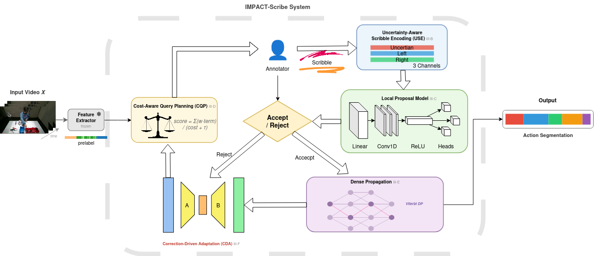
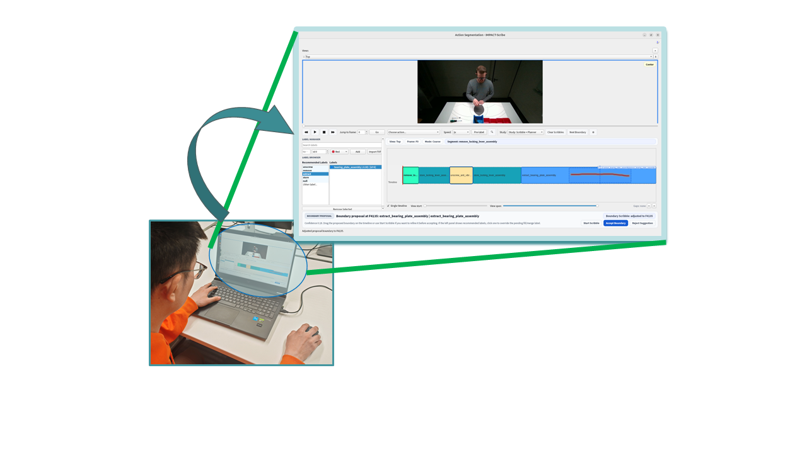
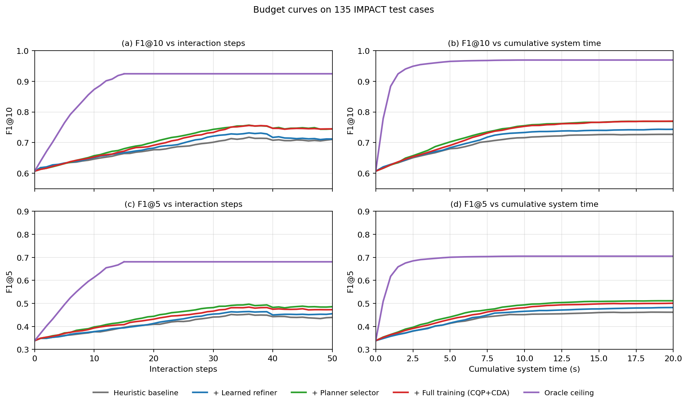
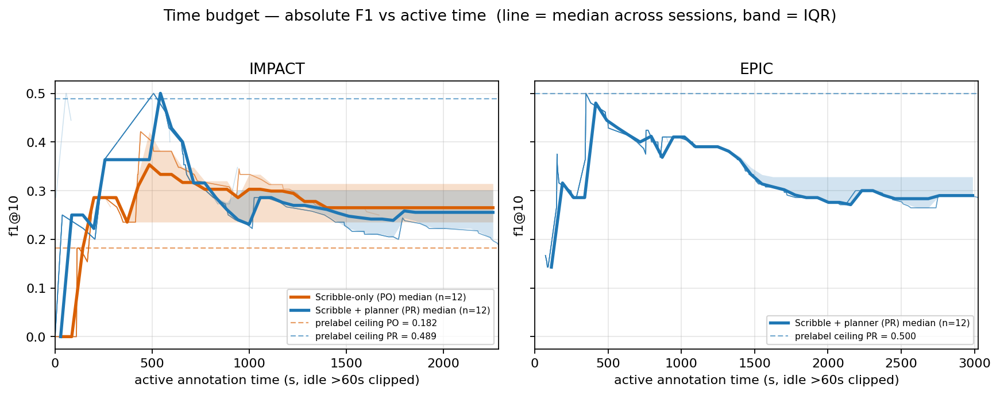
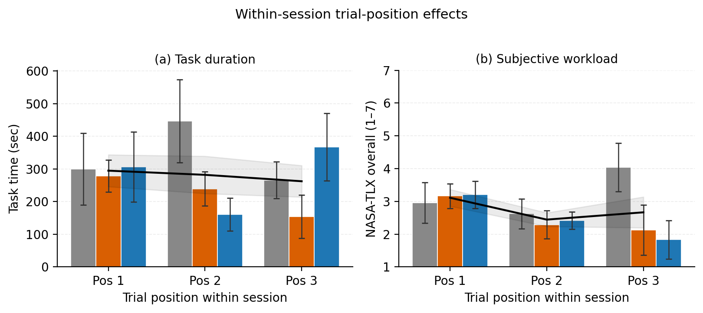
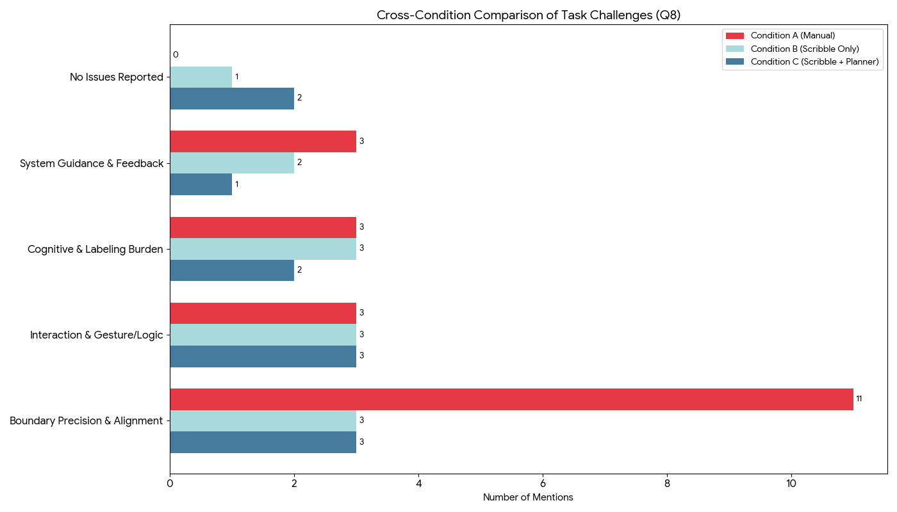
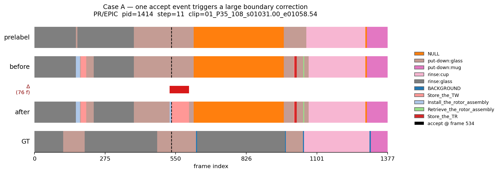
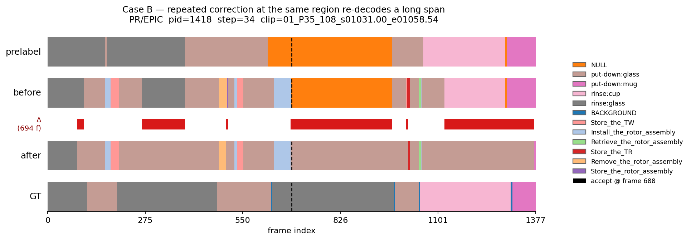

# IMPACT-Scribe: Interactive Temporal Action Segmentation with Boundary Scribbles and Query Planning

IMPACT-Scribe is a human-in-the-loop framework for dense temporal action annotation. Instead of treating each correction as a one-off edit, it turns boundary scribbles into structured local supervision, plans the next query by expected value per cost, propagates accepted edits into a globally coherent sequence, and reuses correction history to improve later interactions.



## Demo

[](https://github.com/BanzQians/IMPACT_AS/blob/main/assets/Demo_2.mp4)

[Watch the demo video online](https://github.com/BanzQians/IMPACT_AS/blob/main/assets/Demo_2.mp4)

## Table of Contents

- [Paper](#paper)
- [Demo](#demo)
- [Installation](#installation)
- [Quickstart](#quickstart)
- [Results](#results)
- [Dataset Preparation](#dataset-preparation)
- [Pretrained Checkpoints](#pretrained-checkpoints)
- [Method-to-Code Map](#method-to-code-map)
- [Repository Structure](#repository-structure)
- [License](#license)
- [Acknowledgments](#acknowledgments)
- [Contact](#contact)
- [Citation](#citation)

## Paper

- arXiv: `TODO after public upload`

## Installation

### Core environment

```bash
conda env create -f environment.yml -p ./.conda/envs/impact_as
```

### Launch the GUI

```bash
./run.sh
```


`run.sh` uses `./.conda/envs/impact_as`, prepares local runtime directories, and performs a small GUI preflight check before starting the Qt application.

If you prefer to launch Python directly:

```bash
./.conda/envs/impact_as/bin/python app.py
```

Optional operation logging:

```bash
./run.sh --oplog
```

### Optional SigLIP2 text-bank environment

The SigLIP2 model snapshot is **not** bundled in this repository.

```bash
CONDA_ENV_ROOT="$PWD/.conda/envs" \
SIGLIP2_CONDA_PREFIX="$PWD/.conda/envs/siglip2" \
bash tools/runners/setup_siglip2_env.sh
```

## Quickstart

This repository ships a validated smoke test that does **not** require the private study datasets.

### One-line smoke test

```bash
python tests/generate_mock_smoke_test.py && python tools/eval_interactive_scribble.py --input data/results/scribble_planner --gt_dir data/gt --out /tmp/impact_eval_mock.json
```

Expected console output:

```text
[EVAL] cases=3 accept_rate=0.333 override_rate=0.667 avg_steps=3.000
[EVAL] final_accepted_boundary_f1@5=1.000
[EVAL] final_accepted_boundary_f1@10=1.000
[EVAL] final_accepted_boundary_f1@25=1.000
[EVAL] final_accepted_boundary_f1@50=1.000
```

What this does:

1. creates three synthetic annotation/sidecar pairs under `data/results/`,
2. creates matching GT frame-label files under `data/gt/`,
3. runs the offline interaction evaluator,
4. writes a JSON report to `/tmp/impact_eval_mock.json`.

## Results













## Dataset Preparation

### Public dataset status

This public tree does **not** currently include download links or released bundles for:

- the IMPACT study sessions used in the paper,
- the EPIC-KITCHENS supplementary human-study sessions,
- the final public feature archives used for paper-scale training.

Use the layout below when preparing the public release package.

### Recommended public-release layout

```text
data/
  impact/
    gt/
      clip_001.txt
      clip_002.txt
    study_logs/
      scribble_only/
        clip_001.json
        clip_001_scribble.json
        clip_002.json
        clip_002_scribble.json
      scribble_planner/
        clip_001.json
        clip_001_scribble.json
        clip_002.json
        clip_002_scribble.json
    features/
      clip_001/
        features.npy
        meta.json
      clip_002/
        features.npy
        meta.json
    features_map.json
  epic_kitchens/
    gt/
    study_logs/
    features/
    features_map.json
```

### Annotation JSON format expected by the offline tools

The parsers accept a native annotation JSON with at least:

```json
{
  "video_id": "clip_001",
  "view": "front",
  "view_start": 0,
  "view_end": 199,
  "labels": [
    { "id": 0, "name": "cut_tomato" },
    { "id": 1, "name": "pour_oil" }
  ],
  "segments": [
    { "start_frame": 0, "end_frame": 49, "action_label": 0 },
    { "start_frame": 50, "end_frame": 99, "action_label": 1 }
  ]
}
```

Accepted segment keys include:

- `start_frame` / `end_frame`
- `start` / `end`
- `f_start` / `f_end`

The label can be given either through:

- `action_label` with a matching entry in `labels`, or
- `label` / `label_name` / `name` directly in the segment entry.

### Sidecar naming and format

For the offline evaluator and exporters, each annotation must be paired with a same-basename sidecar:

- annotation: `clip_001.json`
- sidecar: `clip_001_scribble.json`

The sidecar must contain `correction_history`. The export/eval tools also read `confirmed_accept_records` when present.

### GT formats accepted by the evaluator

`tools/eval_interactive_scribble.py` supports GT files in:

- `.json`
- `.txt`
- `.npy`

Matching is basename-based. For example:

- annotation: `clip_001.json`
- sidecar: `clip_001_scribble.json`
- GT: `clip_001.txt`

### Feature layout expected by training / optional inference

Most training paths expect a per-video directory with:

```text
data/impact/features/clip_001/
  features.npy
  meta.json
```

Use `features_map.json` when one `--features_dir` is not enough:

```json
{
  "clip_001": "data/impact/features/clip_001",
  "clip_001.json": "data/impact/features/clip_001"
}
```

### Feature extraction

A simple ResNet-50 extractor is included:

```bash
python tools/extract_resnet50_feats.py --src videos --out artifacts
```

This writes `artifacts/features/<video_name>.npy` in `(2048, T)` layout.

### Synthetic scribble generation for local-refiner pretraining

If you have native annotation JSON files and corresponding features, you can generate synthetic scribble supervision with:

```bash
python tools/simulate_scribbles.py --input data/impact/study_logs/scribble_only --output artifacts/impact_synthetic_scribbles.jsonl
```

## Pretrained Checkpoints

### Bundled in this repository

- Starter local refiner:
  - `configs/models/starter_local_refiner.pt`
  - auto-discovered by the GUI
- I3D RGB checkpoint:
  - `external/pytorch-i3d/models/rgb_imagenet.pt`
- Optional ASOT checkpoints:
  - `external/action_seg_ot/weights/epoch034-step1610.ckpt`
  - `external/action_seg_ot/weights/asot_s8ijjapy_final.pth`

### Not bundled

- Optional SigLIP2 text-bank model:
  - not bundled / not tracked
  - default local path: `external/huggingface/google--siglip2-base-patch16-224`
  - setup: `bash tools/runners/setup_siglip2_env.sh`
  - if unavailable, the app falls back to the hashed lexical text-bank backend

### Checkpoint hashes

| Checkpoint | Size | SHA256 |
| --- | ---: | --- |
| `configs/models/starter_local_refiner.pt` | 1.3 MB | `b76060b2eab6787d47a1eb73f192da0406664bd2d8f82ce57309c0ccc01bdf8c` |
| `external/pytorch-i3d/models/rgb_imagenet.pt` | 49 MB | `2609088c2e8c868187c9921c50bc225329a9057ed75e76120e0b4a397a2c7538` |
| `external/action_seg_ot/weights/epoch034-step1610.ckpt` | 1.6 MB | `adadc435e9503f7d86fe81c0ba1a38789546fcbdab14b5cd6321fa8b8a907f75` |
| `external/action_seg_ot/weights/asot_s8ijjapy_final.pth` | 56 KB | `b549360f4e7f4e48c3779f7b46cd5d8140944e90ab2d647166098dbae04f45ec` |

## Method-to-Code Map

### Uncertainty-Aware Scribble Encoding (USE)

- `core/temporal_scribble.py`
- key objects:
  - `TemporalScribble`
  - `TemporalScribbleSet`
  - `build_scribble_channels`

### Local Proposal Model

- runtime inference:
  - `core/local_boundary_refiner.py`
- training:
  - `tools/train_local_refiner.py`
- current learnable model:
  - `TinyLocalBoundaryModel`

### Cost-Aware Query Planning (CQP)

- `core/query_planner.py`
- key objects:
  - `QueryCandidate`
  - `QueryPlannerWeights`
  - `QueryUtilityModel`
  - `QueryCostModel`
- scoring function:
  - `score_candidate`

### Dense Propagation

- `core/structured_decode.py`
- key objects:
  - `ConfirmedWindow`
  - `SoftConstraint`
- constrained decode:
  - `decode_frame_labels_with_constraints`

### Correction-Driven Adaptation (CDA)

- real-correction export:
  - `tools/export_real_correction_adaptation.py`
- query-model fitting:
  - `tools/train_query_model.py`
- background local-refiner adaptation:
  - `core/background_trainer.py`

## Repository Structure

```text
app.py                              # GUI entry point
run.sh                              # Linux/X11 launcher for the in-repo Conda env
configs/
  models/
    starter_local_refiner.pt        # bundled starter local-refiner checkpoint
core/
  temporal_scribble.py              # scribble interval encoding
  local_boundary_refiner.py         # runtime local proposal model + heuristic fallback
  query_planner.py                  # candidate scoring, utility model, cost model
  structured_decode.py              # constrained dense propagation
  background_trainer.py             # background adaptation loop
tools/
  eval_interactive_scribble.py      # offline study-log evaluation
  export_real_correction_adaptation.py
  export_confirmed_windows.py
  simulate_scribbles.py
  train_local_refiner.py
  train_query_model.py
  train_global_model_from_windows.py
  extract_resnet50_feats.py
  asot_full_infer_adapter.py
ui/
  action_window.py                  # main action-segmentation workflow
  timeline.py                       # timeline + scribble interaction
docs/
  human_study_protocol_en.md        # study protocol
  assets/quick_start/               # GUI screenshots
external/
  action_seg_ot/                    # optional ASOT baseline code + weights
  pytorch-i3d/                      # optional I3D backbone code + weights
tests/
  generate_mock_smoke_test.py       # synthetic quickstart generator
```

## License

This repository is licensed under **Apache License 2.0**. See [LICENSE](LICENSE).

Third-party code under `external/` keeps its own licenses:

- `external/action_seg_ot/LICENSE`
- `external/pytorch-i3d/LICENSE.txt`

## Acknowledgments

This repository includes or interfaces with the following upstream components:

- ASOT: `external/action_seg_ot`
- PyTorch-I3D: `external/pytorch-i3d`

Please cite and respect the licenses of those projects when using the optional baseline code or pretrained weights.

## Contact

- Corresponding author: `di.wen@kit.edu`

## Citation

```bibtex
@inproceedings{yin2026impact_scribe,
  title     = {IMPACT-Scribe: Interactive Temporal Action Segmentation with Boundary Scribbles and Query Planning},
  author    = {Qian Yin and Di Wen and Kunyu Peng and David Schneider and Zeyun Zhong and Alexander Jaus and Zdravko Marinov and Jiale Wei and Ruiping Liu and Junwei Zheng and Yufan Chen and Chen Zhang and Lei Qi and Rainer Stiefelhagen},
  booktitle = {IEEE International Conference on Systems, Man, and Cybernetics (SMC)},
  year      = {2026},
  note      = {Under review}
}
```
